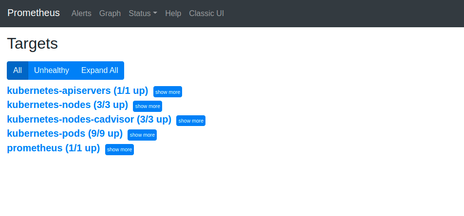
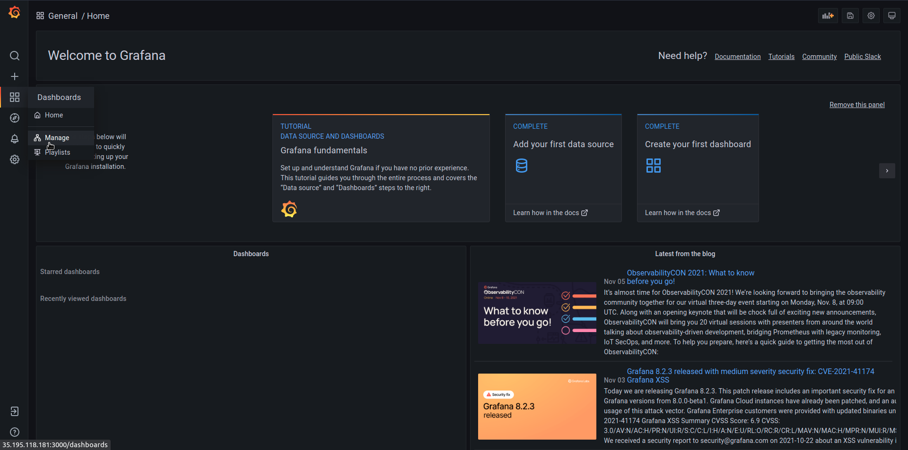

##  This Directory contains the folders and files for the GCP Kubernetes with Service Mesh

The components are the following:

* Infrastructure Provisioning and Configuration with Terraform
* Folders for Modules of specific Kubernetes Cluster Provisioning and Pods and Services Deployment
* Includes the deployment of a Service Mesh with integrated Prometheus and Grafana for monitoring purposes

The Kubernetes Cluster is the same used in Project `k8scloud` and so, it is the same Project but now with complementary components (Service Mesh and Monitoring).
As such, most of the files are identical, and so you may **just copy them to this Project Folder**:
- the `terraform.tfvars`
- the `*.json` file of the GCP API keys


Before running anything, it is advisable to take a look into how a service mesh works, more specifically [Istio](https://istio.io/latest/about/service-mesh/).

## Required Component

Download **Istio** to the `k8scloudmesh` directory:

```shell
$ curl -L https://istio.io/downloadIstio | ISTIO_VERSION=1.9.2 sh -
```

## Provisioning the Solution

1. First of all check Terraform to install all the necessary providers:

```shell
$ terraform init
```


1. Plan and then apply the configuration by running:

```shell
$ terraform plan

$ terraform apply
```

## Verifying the deployment

To verify the deployment, let's see if everything is running smoothly. 
Unlike the last lab, where Redis Pods were running in the `default` **namespace**, this time they are running in the `application` **namespace** (can be verified in the file `gcp_k8s/k8s-pods.tf`).

A second **namespace** was created: `istio-system`, for the Service Mesh **Control Plane**. This will include the monitoring tools.

1. So, let's connect to our cluster and explore what is inside.

Just like in the last lab, copy the command to connect to the created cluster from the Google Cloud Console, in order to configure the `kubectl` command line tool.

2. Now, check if Redis Pods were successfuly created. For that purpose use the command `kubectl get pods` but with a slight difference. Since the Pods were created in the `application` **namespace**, we need to add `-n application` to tye command:

```shell
$ kubectl get pods -n application
```

The result should be as the following figure:


Notice that in the previous lab there was only one container running in each Pod (`READY: 1/1`), but this time, each Pod has two containers running (`READY: 2/2`). This is due to the label added in the **namespace** creation, corresponding to the injected **sidecar** container of the Istio Service Mesh. 
Check the role of the second container by searching in Istio's documentation.

3. The same way we saw the pods for the `application` **namespace**, now we want all the information in the `istio-system` **namespace**:

```shell
$ kubectl get all -n istio-system
```

This will show that `istiod`, `grafana` and `prometheus` pods are running, and that `services` and `replica sets` were deployed successfully.

4. The Terraform file that deploys Istio in the Cluster is `gcp_k8s/k8s-istio.tf`.

5. The Terraform file `gcp_k8s/k8s-monitoring.tf` deploys **Prometheus** and **Grafana** using the configuration files in `gcp_k8s/monitoring/` folder. If you want to make changes in the configuration of those applications those are the files for that purpose.

6. Now, let's access the monitoring tools by their IP addresses. To do this, we need to access the external IP addresses provided by the corresponding services: `kubectl get svc -n istio-system`. In a browser, access **Grafana** and **Prometheus** IPs in the respective ports, **3000** and **9090**.

Explore both interfaces as follows:

### Prometheus

For example, in **Prometheus**, you can explore the different **targets** being used in order to scrape the metrics of interest, by going to `Status -> Targets` as in the following figures. Click in `Expand all` and explore the different metrics:



 
### Grafana

First you will need to insert the credentials that are defined in the respective configuration file. (Username: `admin`, Password: `password`)

In Grafana, you can explore the different **Dashboards** created by the current configuration (by retrieving data from Prometheus targets). Go to `Dashboard -> Manage`, select `Istio` folder and explore each **Dashboard**.


